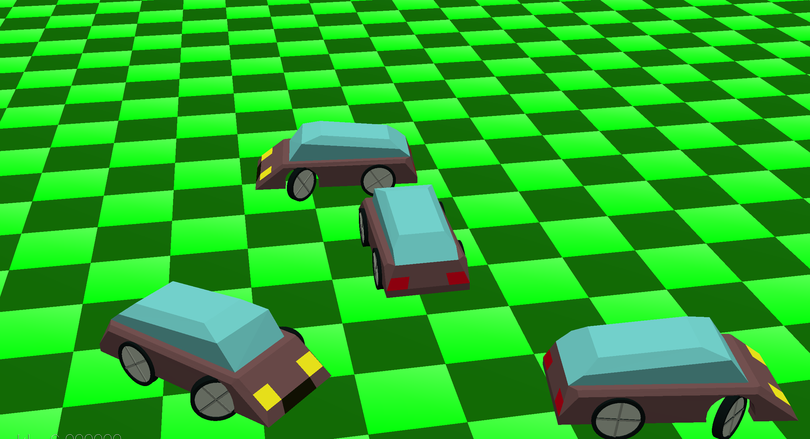

# (TODO: your game's title)

Author: (TODO: your name)

Design: (TODO: In two sentences or fewer, describe what is new and interesting about your game.)

Screen Shot:

How To Play:

(TODO: describe the controls and (if needed) goals/strategy.)

Sources: (TODO: list a source URL for any assets you did not create yourself. Make sure you have a license for the asset.)

This game was built with [NEST](NEST.md).

### SOURCES
assets/car-kit-1.5:
- License: (CC0 1.0 Universal) You're free to use these game assets in any project, personal or commercial. There's no need to ask permission before using these. Giving attribution is not required, but is greatly appreciated!

