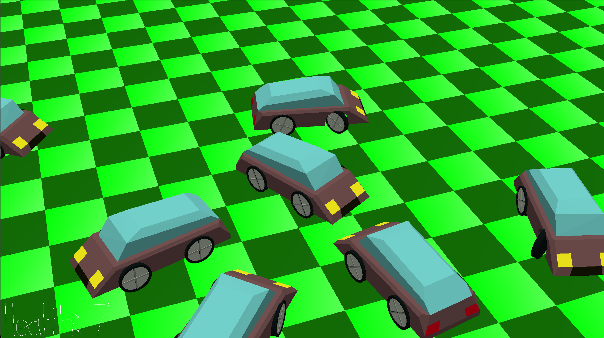

# car.BONK

Author: Gustavo Silvera

Design: car.BONK is a 3D "bumper cars"-style game where you (the primary car) are being targetted by all the other cars and your goal is to survive (bonk them instead!). Bonk's only count if they are ["rear-end"](https://en.wikipedia.org/wiki/Rear-end_collision) or ["broadside"/"T-bone"](https://en.wikipedia.org/wiki/Side_collision) collisions (meaning head-on collisions are NOT bonks). The twist is that all the enemy cars (non-playables) are not very smart and can also bonk each other! (So it is advantageous to maneuver them to do so).

## Screen Shot:

## How To Play:
- When you first play the game you can use "`WASD`" to apply controls to the player-car. This includes:
    - `W` to apply throttle
    - `S` to apply brakes/reverse
    - `D` to steer right
    - `A` to steer left

- Additionally, you can use your `mouse` cursor to change the angle of the main camera.  

- For fun (not especially useful, but might be) you can also press `Space` for your car to Jump!

- As a debug visualization of the rotated-bounding-box logic, press `B`. These change colour upon collisions. 

    
    - Demonstration of bounding boxes (white lines, red on collisions)

## Extra Notes
- You start with 10 health points and every bonk decreases your health by 1. The enemy cars each have a starting health of 2, so they can be defeated much faster, but there are 16 of them so beware!
- You can get bonked at most 4 times per second, so better keep an eye on the health counter at the bottom left!.

This game was built with [NEST](NEST.md).
